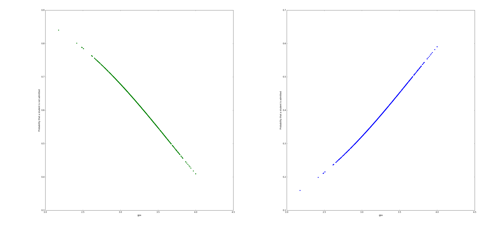
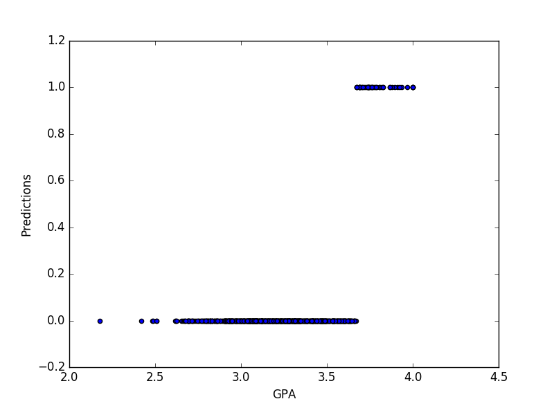

# university-admissions
Analyze and predict university admissions using logistic regression class

# Usage
`python university_admissions.py`

# Data
The input file has three columns, admit (0 for not admitted, 1 for admitted), gpa and gre. Below is an example of the data

|   admit       |gpa         |gre |
|---------------|------------|----|
|      0  |3.177277  |594.102992|
|      0  |3.412655  |631.528607|
|      0  |2.728097  |553.714399|
|      0  |3.093559  |551.089985|
|      0  |3.141923  |537.184894|

Data has been downloaded from dataquest.io

# Analysis
After fitting the model using sklearn's Logistic Regression we get the probabilities of both labels. Below is a scatter plot that represents this

Using the same Logistic Regression library, we run the predictions against GPA. Below is a scatter plot of the predictions

The data predicts that there are **598** out of **644** who will not be admitted and **46** out of **644** will be admitted.

**Accuracy** of the predicted admissions is **0.65**

### outcomes of the binary classification
True Positives is **31**
True Negatives is **385**
False Positives is **15**
False Negatives is **213**

The proportion of applicants that were correctly admitted (Sensitivity) is **0.127049180328**. It looks like the model is not good at predicting admissions
The proportion of applicants that were correctly rejected (specificity) is **0.9625**. The model is good at predicting rejections
